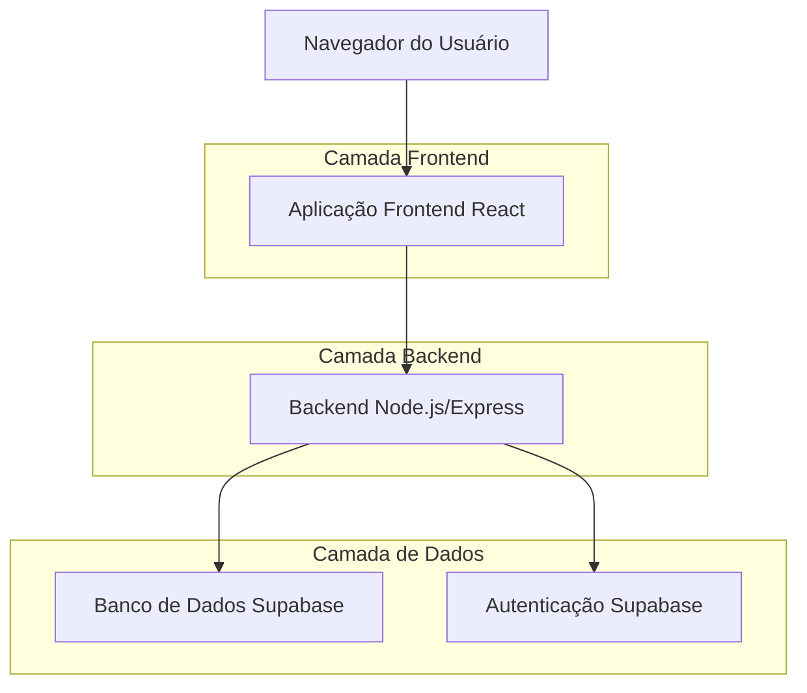
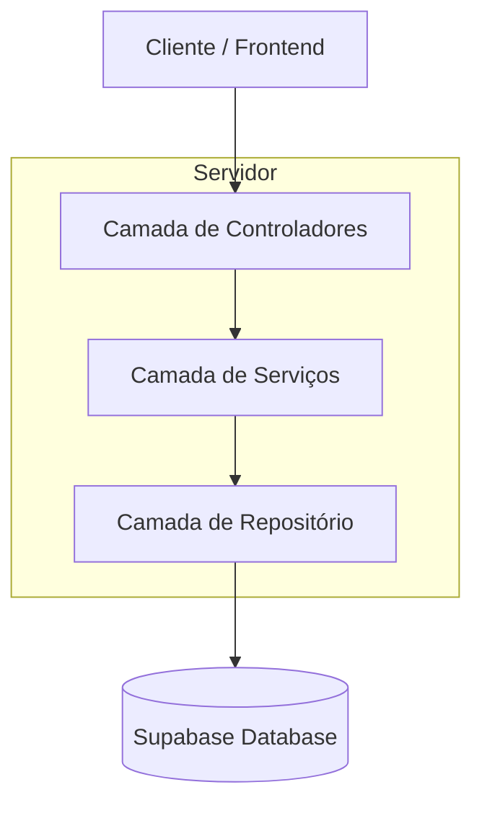
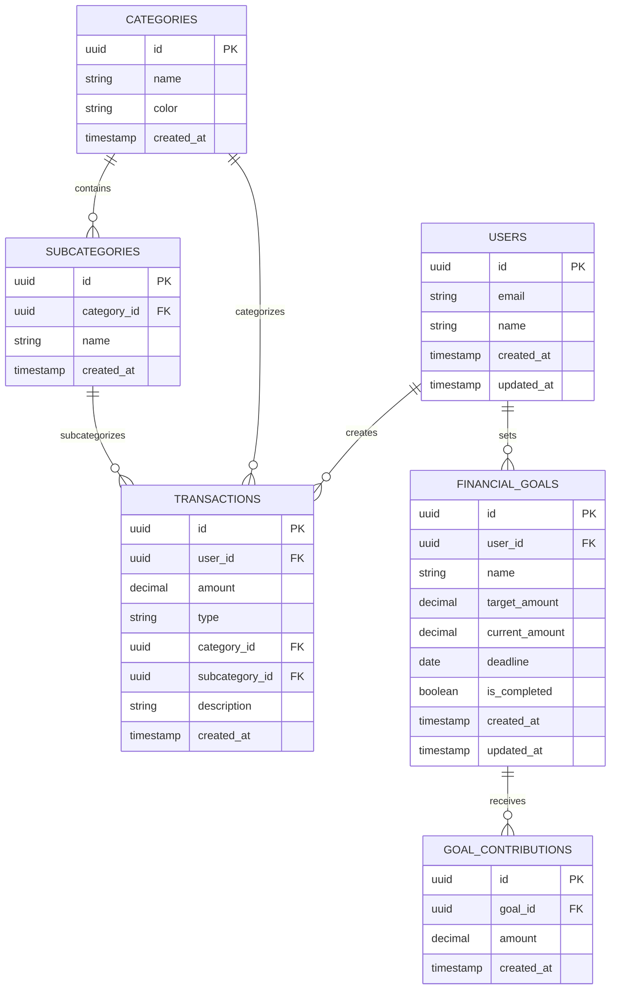

# Finança Fácil - Documento de Arquitetura Técnica

## 1. Design da Arquitetura



## 2. Descrição das Tecnologias

* **Frontend**: React\@18 + TypeScript + Tailwind CSS + Vite

* **Backend**: Node.js\@18 + Express\@4 + TypeScript

* **Banco de Dados**: Supabase (PostgreSQL)

* **Autenticação**: Supabase Auth

* **Estilização**: Tailwind CSS + Styled Components

## 3. Definições de Rotas

| Rota       | Propósito                                                  |
| ---------- | ---------------------------------------------------------- |
| /          | Página inicial, redireciona para /dashboard se autenticado |
| /login     | Página de login e registro de usuários                     |
| /dashboard | Dashboard principal com resumo financeiro e transações     |
| /metas     | Página de gerenciamento de metas financeiras               |
| /graficos  | Página de visualizações e relatórios gráficos              |
| /perfil    | Página de configurações do usuário                         |

## 4. Definições de API

### 4.1 APIs Principais

**Autenticação de usuários**

```
POST /api/auth/login
```

Request:

| Nome do Parâmetro | Tipo   | Obrigatório | Descrição        |
| ----------------- | ------ | ----------- | ---------------- |
| email             | string | true        | Email do usuário |
| password          | string | true        | Senha do usuário |

Response:

| Nome do Parâmetro | Tipo    | Descrição              |
| ----------------- | ------- | ---------------------- |
| success           | boolean | Status da autenticação |
| user              | object  | Dados do usuário       |
| token             | string  | Token de acesso        |

**Gerenciamento de Transações**

```
POST /api/transactions
GET /api/transactions
DELETE /api/transactions/:id
```

Request (POST):

| Nome do Parâmetro | Tipo   | Obrigatório | Descrição                  |
| ----------------- | ------ | ----------- | -------------------------- |
| amount            | number | true        | Valor da transação         |
| type              | string | true        | Tipo: 'entrada' ou 'saida' |
| category\_id      | number | true        | ID da categoria            |
| subcategory\_id   | number | false       | ID da subcategoria         |
| description       | string | false       | Descrição opcional         |

**Gerenciamento de Metas**

```
POST /api/goals
GET /api/goals
PUT /api/goals/:id
DELETE /api/goals/:id
POST /api/goals/:id/contributions
```

Request (POST Goals):

| Nome do Parâmetro | Tipo   | Obrigatório | Descrição                 |
| ----------------- | ------ | ----------- | ------------------------- |
| name              | string | true        | Nome da meta              |
| target\_amount    | number | true        | Valor alvo                |
| deadline          | date   | false       | Prazo para atingir a meta |

## 5. Arquitetura do Servidor



## 6. Modelo de Dados

### 6.1 Definição do Modelo de Dados



### 6.2 Linguagem de Definição de Dados

**Tabela de Usuários (users)**

```sql
-- Criar tabela de usuários
CREATE TABLE users (
    id UUID PRIMARY KEY DEFAULT gen_random_uuid(),
    email VARCHAR(255) UNIQUE NOT NULL,
    name VARCHAR(100) NOT NULL,
    created_at TIMESTAMP WITH TIME ZONE DEFAULT NOW(),
    updated_at TIMESTAMP WITH TIME ZONE DEFAULT NOW()
);

-- Políticas de segurança
ALTER TABLE users ENABLE ROW LEVEL SECURITY;
CREATE POLICY "Users can view own data" ON users FOR SELECT USING (auth.uid() = id);
CREATE POLICY "Users can update own data" ON users FOR UPDATE USING (auth.uid() = id);
```

**Tabela de Categorias (categories)**

```sql
-- Criar tabela de categorias
CREATE TABLE categories (
    id UUID PRIMARY KEY DEFAULT gen_random_uuid(),
    name VARCHAR(100) NOT NULL,
    color VARCHAR(7) DEFAULT '#16c64f',
    created_at TIMESTAMP WITH TIME ZONE DEFAULT NOW()
);

-- Dados iniciais
INSERT INTO categories (name, color) VALUES 
('Alimentação', '#ff6b6b'),
('Transporte', '#4ecdc4'),
('Moradia', '#45b7d1'),
('Saúde', '#96ceb4'),
('Educação', '#feca57'),
('Lazer', '#ff9ff3'),
('Salário', '#16c64f'),
('Freelance', '#54a0ff');

-- Permissões
GRANT SELECT ON categories TO anon;
GRANT SELECT ON categories TO authenticated;
```

**Tabela de Subcategorias (subcategories)**

```sql
-- Criar tabela de subcategorias
CREATE TABLE subcategories (
    id UUID PRIMARY KEY DEFAULT gen_random_uuid(),
    category_id UUID REFERENCES categories(id) ON DELETE CASCADE,
    name VARCHAR(100) NOT NULL,
    created_at TIMESTAMP WITH TIME ZONE DEFAULT NOW()
);

-- Índices
CREATE INDEX idx_subcategories_category_id ON subcategories(category_id);

-- Permissões
GRANT SELECT ON subcategories TO anon;
GRANT SELECT ON subcategories TO authenticated;
```

**Tabela de Transações (transactions)**

```sql
-- Criar tabela de transações
CREATE TABLE transactions (
    id UUID PRIMARY KEY DEFAULT gen_random_uuid(),
    user_id UUID REFERENCES auth.users(id) ON DELETE CASCADE,
    amount DECIMAL(10,2) NOT NULL,
    type VARCHAR(10) NOT NULL CHECK (type IN ('entrada', 'saida')),
    category_id UUID REFERENCES categories(id),
    subcategory_id UUID REFERENCES subcategories(id),
    description TEXT,
    created_at TIMESTAMP WITH TIME ZONE DEFAULT NOW()
);

-- Índices
CREATE INDEX idx_transactions_user_id ON transactions(user_id);
CREATE INDEX idx_transactions_created_at ON transactions(created_at DESC);
CREATE INDEX idx_transactions_type ON transactions(type);

-- Políticas de segurança
ALTER TABLE transactions ENABLE ROW LEVEL SECURITY;
CREATE POLICY "Users can view own transactions" ON transactions FOR SELECT USING (auth.uid() = user_id);
CREATE POLICY "Users can insert own transactions" ON transactions FOR INSERT WITH CHECK (auth.uid() = user_id);
CREATE POLICY "Users can delete own transactions" ON transactions FOR DELETE USING (auth.uid() = user_id);
```

**Tabela de Metas Financeiras (financial\_goals)**

```sql
-- Criar tabela de metas financeiras
CREATE TABLE financial_goals (
    id UUID PRIMARY KEY DEFAULT gen_random_uuid(),
    user_id UUID REFERENCES auth.users(id) ON DELETE CASCADE,
    name VARCHAR(200) NOT NULL,
    target_amount DECIMAL(10,2) NOT NULL,
    current_amount DECIMAL(10,2) DEFAULT 0,
    deadline DATE,
    is_completed BOOLEAN DEFAULT FALSE,
    created_at TIMESTAMP WITH TIME ZONE DEFAULT NOW(),
    updated_at TIMESTAMP WITH TIME ZONE DEFAULT NOW()
);

-- Índices
CREATE INDEX idx_financial_goals_user_id ON financial_goals(user_id);
CREATE INDEX idx_financial_goals_is_completed ON financial_goals(is_completed);

-- Políticas de segurança
ALTER TABLE financial_goals ENABLE ROW LEVEL SECURITY;
CREATE POLICY "Users can manage own goals" ON financial_goals FOR ALL USING (auth.uid() = user_id);
```

**Tabela de Contribuições para Metas (goal\_contributions)**

```sql
-- Criar tabela de contribuições
CREATE TABLE goal_contributions (
    id UUID PRIMARY KEY DEFAULT gen_random_uuid(),
    goal_id UUID REFERENCES financial_goals(id) ON DELETE CASCADE,
    amount DECIMAL(10,2) NOT NULL,
    created_at TIMESTAMP WITH TIME ZONE DEFAULT NOW()
);

-- Índices
CREATE INDEX idx_goal_contributions_goal_id ON goal_contributions(goal_id);
CREATE INDEX idx_goal_contributions_created_at ON goal_contributions(created_at DESC);

-- Políticas de segurança
ALTER TABLE goal_contributions ENABLE ROW LEVEL SECURITY;
CREATE POLICY "Users can manage contributions to own goals" ON goal_contributions 
FOR ALL USING (
    goal_id IN (
        SELECT id FROM financial_goals WHERE user_id = auth.uid()
    )
);

-- Função para atualizar valor atual da meta
CREATE OR REPLACE FUNCTION update_goal_current_amount()
RETURNS TRIGGER AS $$
BEGIN
    UPDATE financial_goals 
    SET current_amount = (
        SELECT COALESCE(SUM(amount), 0) 
        FROM goal_contributions 
        WHERE goal_id = NEW.goal_id
    ),
    is_completed = (
        SELECT COALESCE(SUM(amount), 0) >= target_amount
        FROM goal_contributions 
        WHERE goal_id = NEW.goal_id
    )
    WHERE id = NEW.goal_id;
    
    RETURN NEW;
END;
$$ LANGUAGE plpgsql;

-- Trigger para atualizar automaticamente o valor atual
CREATE TRIGGER trigger_update_goal_amount
    AFTER INSERT ON goal_contributions
    FOR EACH ROW
    EXECUTE FUNCTION update_goal_current_amount();
```

