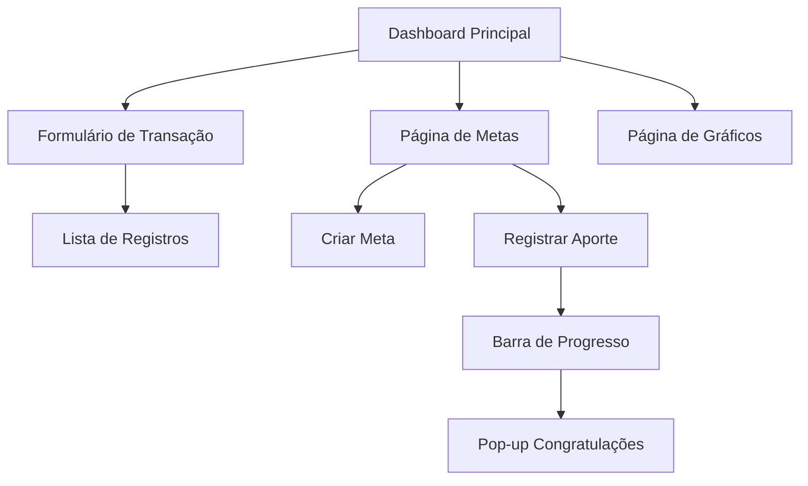

# Finança Fácil - Documento de Requisitos do Produto

## 1. Visão Geral do Produto

O Finança Fácil é uma aplicação web intuitiva e direta para controle financeiro pessoal que permite aos usuários gerenciar suas finanças de forma eficiente e organizada.

O sistema resolve o problema da desorganização financeira pessoal, oferecendo ferramentas para registro de transações, categorização detalhada e acompanhamento de metas financeiras, proporcionando uma experiência fluida e agradável para o gerenciamento financeiro.

## 2. Funcionalidades Principais

### 2.1 Módulos de Funcionalidades

Nossos requisitos do Finança Fácil consistem nas seguintes páginas principais:

1. **Dashboard Principal**: painel de controle, resumo financeiro, formulário de transações, lista de registros.
2. **Página de Metas Financeiras**: gerenciamento de metas, barras de progresso, registro de aportes.
3. **Página de Gráficos**: visualizações financeiras, relatórios por categoria, análises temporais.

### 2.2 Detalhes das Páginas

| Nome da Página | Nome do Módulo | Descrição da Funcionalidade |
|----------------|----------------|------------------------------|
| Dashboard Principal | Painel de Resumo | Exibir saldo atual, total de entradas (verde), total de saídas (vermelho) em cards visuais |
| Dashboard Principal | Formulário de Transação | Registrar entradas e saídas com campos: valor, tipo (entrada/saída), categoria, subcategoria, descrição opcional |
| Dashboard Principal | Lista de Registros | Mostrar histórico de transações em tabela com colunas: tipo, valor, categoria, descrição, ação de excluir |
| Dashboard Principal | Navegação Lateral | Menu com ícones para Painel Finanças, Gráficos e Metas |
| Metas Financeiras | Gerenciamento de Metas | Criar, editar e excluir metas financeiras (sonhos) com nome, valor alvo e prazo |
| Metas Financeiras | Registro de Aportes | Adicionar contribuições para cada meta com valor e data |
| Metas Financeiras | Barra de Progresso | Exibir progresso visual de cada meta com percentual alcançado |
| Metas Financeiras | Pop-up de Congratulações | Mostrar mensagem de parabéns quando meta for atingida |
| Gráficos | Visualizações | Gerar gráficos de receitas vs despesas, distribuição por categorias |

## 3. Processo Principal

**Fluxo Principal do Usuário:**

1. O usuário acessa o dashboard principal e visualiza seu resumo financeiro atual
2. Registra uma nova transação preenchendo o formulário (valor, tipo, categoria, subcategoria, descrição)
3. A transação é salva e aparece na lista de registros, atualizando automaticamente os totais
4. Para metas financeiras, o usuário navega para a aba dedicada
5. Cria uma nova meta definindo nome, valor alvo e prazo
6. Registra aportes na meta, visualizando o progresso na barra
7. Ao atingir 100% da meta, recebe pop-up de congratulações
8. Pode visualizar gráficos e relatórios na aba de gráficos

## 4. Design da Interface do Usuário

### 4.1 Estilo de Design

- **Cores Primárias**: 
  - Cor de fundo: `#f1f3ef`
  - Cor dos cards: `#fefdf9`
  - Cor de destaque (verde): `#16c64f`
  - Verde para entradas: `#16c64f`
  - Vermelho para saídas: `#ff4444`

- **Estilo dos Botões**: Arredondados com cantos suaves, botão principal verde `#16c64f`

- **Tipografia**: Fonte moderna e limpa, tamanhos: títulos 24px, subtítulos 18px, texto normal 14px

- **Layout**: Design baseado em cards com sidebar esquerda, layout responsivo

- **Ícones**: Ícones minimalistas para casa (dashboard), gráficos e metas

### 4.2 Visão Geral do Design das Páginas

| Nome da Página | Nome do Módulo | Elementos da UI |
|----------------|----------------|------------------|
| Dashboard Principal | Sidebar | Fundo verde `#16c64f`, logo "facilite", menu com ícones brancos |
| Dashboard Principal | Cards de Resumo | Cards brancos `#fefdf9` com sombra sutil, valores em verde/vermelho |
| Dashboard Principal | Formulário | Campos com bordas suaves, dropdown para categorias, botão "Enviar" verde |
| Dashboard Principal | Tabela de Registros | Cabeçalho com fundo claro, linhas alternadas, ícone de lixeira para exclusão |
| Metas Financeiras | Cards de Meta | Layout de card com título, valor alvo, barra de progresso verde |
| Metas Financeiras | Barra de Progresso | Barra horizontal verde `#16c64f` com percentual |
| Gráficos | Visualizações | Gráficos com cores harmoniosas, fundo branco dos cards |

### 4.3 Responsividade

O produto é desktop-first com adaptação para mobile, incluindo otimização para interação touch em dispositivos móveis. A sidebar se transforma em menu hambúrguer em telas menores.