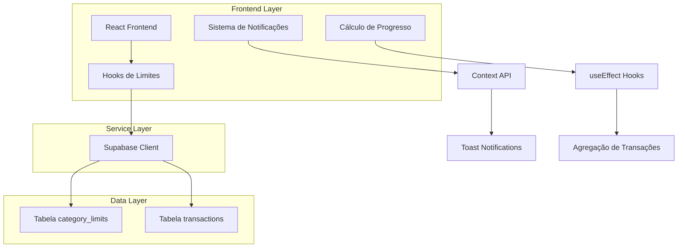
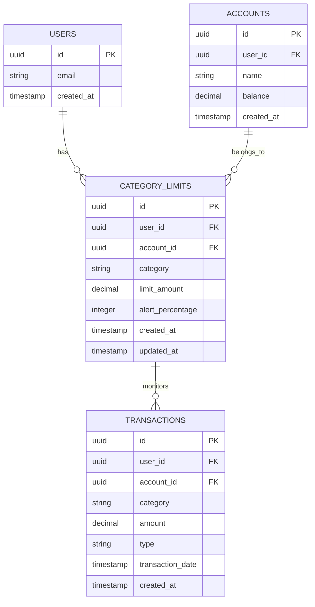
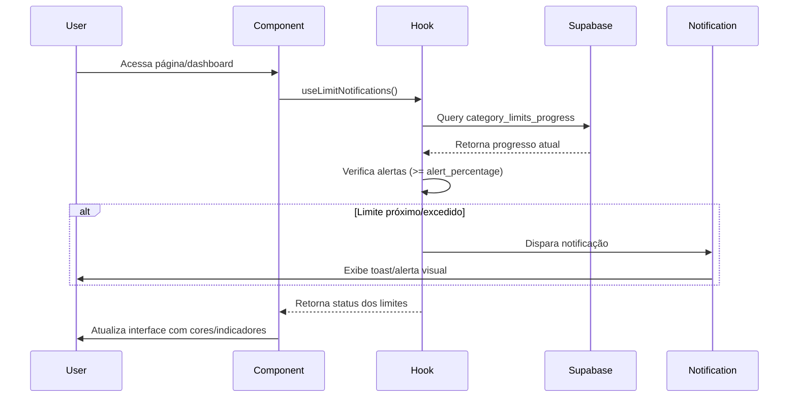

# Arquitetura Técnica - Sistema de Limites por Categorias

## 1. Arquitetura do Sistema



## 2. Descrição das Tecnologias

* Frontend: React\@18 + TypeScript + Tailwind CSS + Vite

* Backend: Supabase (PostgreSQL + Auth + Real-time)

* Estado: Context API + Custom Hooks

* Notificações: React Hot Toast

* Ícones: Lucide React

## 3. Definições de Rotas

| Rota       | Propósito                                                       |
| ---------- | --------------------------------------------------------------- |
| /limits    | Página principal de limites, exibe lista e permite configuração |
| /dashboard | Dashboard com widget resumido dos limites mais críticos         |

## 4. Definições da API

### 4.1 Hooks Personalizados

**useCategoryLimits**

```typescript
interface CategoryLimit {
  id: string;
  user_id: string;
  account_id: string;
  category: string;
  limit_amount: number;
  alert_percentage: number;
  created_at: string;
  updated_at: string;
}

interface UseCategoryLimitsReturn {
  limits: CategoryLimit[];
  loading: boolean;
  error: string | null;
  createLimit: (limit: Omit<CategoryLimit, 'id' | 'user_id' | 'created_at' | 'updated_at'>) => Promise<void>;
  updateLimit: (id: string, updates: Partial<CategoryLimit>) => Promise<void>;
  deleteLimit: (id: string) => Promise<void>;
  getLimitProgress: (categoryLimit: CategoryLimit) => Promise<LimitProgress>;
}
```

**useLimitNotifications**

```typescript
interface LimitProgress {
  category: string;
  limitAmount: number;
  currentSpent: number;
  percentage: number;
  status: 'safe' | 'warning' | 'exceeded';
  alertTriggered: boolean;
}

interface UseLimitNotificationsReturn {
  checkLimits: () => Promise<void>;
  notifications: LimitProgress[];
  dismissNotification: (category: string) => void;
}
```

## 5. Modelo de Dados

### 5.1 Definição do Modelo de Dados



### 5.2 Linguagem de Definição de Dados

**Tabela category\_limits**

```sql
-- Criar tabela de limites por categoria
CREATE TABLE category_limits (
    id UUID PRIMARY KEY DEFAULT gen_random_uuid(),
    user_id UUID NOT NULL REFERENCES auth.users(id) ON DELETE CASCADE,
    account_id UUID NOT NULL REFERENCES accounts(id) ON DELETE CASCADE,
    category VARCHAR(100) NOT NULL,
    limit_amount DECIMAL(12,2) NOT NULL CHECK (limit_amount > 0),
    alert_percentage INTEGER DEFAULT 90 CHECK (alert_percentage BETWEEN 1 AND 100),
    created_at TIMESTAMP WITH TIME ZONE DEFAULT NOW(),
    updated_at TIMESTAMP WITH TIME ZONE DEFAULT NOW(),
    
    -- Constraint para evitar limites duplicados por categoria/conta
    UNIQUE(user_id, account_id, category)
);

-- Criar índices para performance
CREATE INDEX idx_category_limits_user_id ON category_limits(user_id);
CREATE INDEX idx_category_limits_account_id ON category_limits(account_id);
CREATE INDEX idx_category_limits_category ON category_limits(category);

-- Trigger para atualizar updated_at
CREATE OR REPLACE FUNCTION update_category_limits_updated_at()
RETURNS TRIGGER AS $$
BEGIN
    NEW.updated_at = NOW();
    RETURN NEW;
END;
$$ LANGUAGE plpgsql;

CREATE TRIGGER trigger_update_category_limits_updated_at
    BEFORE UPDATE ON category_limits
    FOR EACH ROW
    EXECUTE FUNCTION update_category_limits_updated_at();

-- Permissões RLS (Row Level Security)
ALTER TABLE category_limits ENABLE ROW LEVEL SECURITY;

-- Política para usuários autenticados
CREATE POLICY "Users can manage their own category limits" ON category_limits
    FOR ALL USING (auth.uid() = user_id);

-- Permissões para roles
GRANT SELECT ON category_limits TO anon;
GRANT ALL PRIVILEGES ON category_limits TO authenticated;

-- Dados iniciais (categorias padrão)
INSERT INTO category_limits (user_id, account_id, category, limit_amount, alert_percentage)
SELECT 
    auth.uid(),
    (SELECT id FROM accounts WHERE user_id = auth.uid() LIMIT 1),
    unnest(ARRAY['Alimentação', 'Transporte', 'Lazer', 'Saúde', 'Educação']),
    1000.00,
    90
WHERE auth.uid() IS NOT NULL;
```

**View para cálculo de progresso**

```sql
-- View para calcular progresso dos limites
CREATE OR REPLACE VIEW category_limits_progress AS
SELECT 
    cl.id,
    cl.user_id,
    cl.account_id,
    cl.category,
    cl.limit_amount,
    cl.alert_percentage,
    COALESCE(t.total_spent, 0) as current_spent,
    CASE 
        WHEN cl.limit_amount > 0 THEN 
            ROUND((COALESCE(t.total_spent, 0) / cl.limit_amount * 100), 2)
        ELSE 0 
    END as percentage,
    CASE 
        WHEN COALESCE(t.total_spent, 0) >= cl.limit_amount THEN 'exceeded'
        WHEN (COALESCE(t.total_spent, 0) / cl.limit_amount * 100) >= cl.alert_percentage THEN 'warning'
        ELSE 'safe'
    END as status,
    cl.created_at,
    cl.updated_at
FROM category_limits cl
LEFT JOIN (
    SELECT 
        user_id,
        account_id,
        category,
        SUM(ABS(amount)) as total_spent
    FROM transactions 
    WHERE type = 'expense'
        AND EXTRACT(MONTH FROM transaction_date) = EXTRACT(MONTH FROM CURRENT_DATE)
        AND EXTRACT(YEAR FROM transaction_date) = EXTRACT(YEAR FROM CURRENT_DATE)
    GROUP BY user_id, account_id, category
) t ON cl.user_id = t.user_id 
    AND cl.account_id = t.account_id 
    AND cl.category = t.category;

-- Permissões para a view
GRANT SELECT ON category_limits_progress TO authenticated;
```

## 6. Estrutura de Componentes

### 6.1 Componentes Principais

```typescript
// src/pages/Limits.tsx
interface LimitsPageProps {}

// src/components/LimitCard.tsx
interface LimitCardProps {
  limit: CategoryLimit;
  progress: LimitProgress;
  onEdit: (limit: CategoryLimit) => void;
  onDelete: (id: string) => void;
}

// src/components/LimitModal.tsx
interface LimitModalProps {
  isOpen: boolean;
  onClose: () => void;
  limit?: CategoryLimit;
  onSave: (limit: Omit<CategoryLimit, 'id' | 'user_id' | 'created_at' | 'updated_at'>) => void;
}

// src/components/LimitProgressBar.tsx
interface LimitProgressBarProps {
  percentage: number;
  status: 'safe' | 'warning' | 'exceeded';
  showLabel?: boolean;
}

// src/components/LimitNotification.tsx
interface LimitNotificationProps {
  progress: LimitProgress;
  onDismiss: () => void;
}
```

### 6.2 Hooks Personalizados

```typescript
// src/hooks/useCategoryLimits.ts
export const useCategoryLimits = (accountId?: string) => {
  // Implementação do hook para gerenciar limites
};

// src/hooks/useLimitNotifications.ts
export const useLimitNotifications = () => {
  // Implementação do hook para notificações
};

// src/hooks/useLimitProgress.ts
export const useLimitProgress = (limits: CategoryLimit[]) => {
  // Implementação do hook para calcular progresso
};
```

## 7. Fluxo de Notificações



