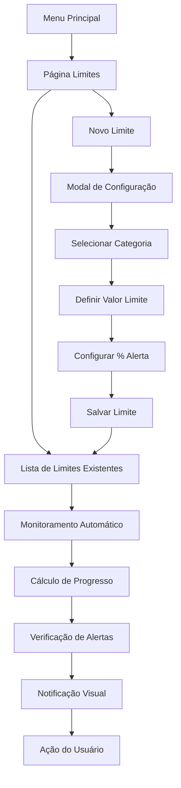

# Sistema de Limites por Categorias - Finança Fácil

## 1. Visão Geral do Produto

O Sistema de Limites por Categorias é uma funcionalidade avançada que permite aos usuários definir e monitorar limites de gastos por categoria, oferecendo controle proativo sobre o orçamento pessoal. O sistema fornece alertas automáticos quando os gastos se aproximam dos limites estabelecidos, promovendo disciplina financeira e prevenção de gastos excessivos.

## 2. Funcionalidades Principais

### 2.1 Papéis de Usuário

| Papel | Método de Registro | Permissões Principais |
|-------|-------------------|----------------------|
| Usuário Autenticado | Login com Supabase Auth | Pode criar, editar e excluir limites de categorias, visualizar progresso e receber notificações |

### 2.2 Módulos de Funcionalidade

Nosso sistema de limites consiste nas seguintes páginas principais:

1. **Página Limites**: configuração de limites, visualização de progresso, gerenciamento de alertas
2. **Modal de Configuração**: criação e edição de limites por categoria
3. **Sistema de Notificações**: alertas visuais e notificações de proximidade de limite
4. **Dashboard Integrado**: visualização resumida dos limites no painel principal

### 2.3 Detalhes das Páginas

| Nome da Página | Nome do Módulo | Descrição da Funcionalidade |
|----------------|----------------|-----------------------------|
| Página Limites | Lista de Limites | Exibir todos os limites configurados com progresso atual, status de alerta e ações de edição/exclusão |
| Página Limites | Configuração de Limite | Criar novo limite selecionando categoria, definindo valor máximo e porcentagem de alerta |
| Página Limites | Progresso Visual | Mostrar barras de progresso coloridas indicando porcentagem de consumo em relação ao limite |
| Modal de Configuração | Formulário de Limite | Permitir seleção de categoria, inserção de valor limite, configuração de porcentagem de alerta (padrão 90%) |
| Sistema de Notificações | Alertas de Proximidade | Exibir notificações quando gastos atingem porcentagem configurada do limite |
| Sistema de Notificações | Alertas Visuais | Destacar categorias com cores de alerta (amarelo para proximidade, vermelho para limite excedido) |
| Dashboard | Resumo de Limites | Mostrar widget com limites mais próximos de serem atingidos |

## 3. Fluxo Principal de Uso

**Fluxo do Usuário:**

1. Usuário acessa a página "Limites" através do menu principal
2. Visualiza lista de limites existentes com progresso atual
3. Clica em "Novo Limite" para configurar um novo limite
4. Seleciona categoria, define valor limite e porcentagem de alerta
5. Sistema calcula automaticamente o progresso baseado nas transações existentes
6. Quando gastos se aproximam do limite, sistema exibe alertas visuais
7. Usuário recebe notificações e pode ajustar comportamento de gastos

## 4. Design da Interface

### 4.1 Estilo de Design

- **Cores Primárias**: Verde (#10B981) para limites seguros, Amarelo (#F59E0B) para alertas de proximidade
- **Cores Secundárias**: Vermelho (#EF4444) para limites excedidos, Cinza (#6B7280) para elementos neutros
- **Estilo de Botões**: Arredondados com sombra sutil, estados hover bem definidos
- **Fonte**: Inter, tamanhos 14px (corpo), 16px (títulos), 12px (legendas)
- **Layout**: Design baseado em cards com espaçamento generoso, navegação superior
- **Ícones**: Lucide React com estilo outline, ícones de alerta, progresso e configuração

### 4.2 Visão Geral do Design das Páginas

| Nome da Página | Nome do Módulo | Elementos da UI |
|----------------|----------------|----------------|
| Página Limites | Cabeçalho | Título "Limites por Categoria", botão "Novo Limite" (verde, ícone +), filtros por status |
| Página Limites | Lista de Limites | Cards com categoria, valor limite, progresso (barra colorida), valor gasto atual, ações (editar/excluir) |
| Página Limites | Progresso Visual | Barras de progresso responsivas com cores dinâmicas (verde < 70%, amarelo 70-90%, vermelho > 90%) |
| Modal de Configuração | Formulário | Select de categorias, input de valor (R$), slider para % de alerta, botões cancelar/salvar |
| Sistema de Notificações | Toast Alerts | Notificações temporárias no canto superior direito com ícones de alerta e ações |
| Dashboard | Widget de Limites | Card compacto mostrando 3 limites mais críticos com mini barras de progresso |

### 4.3 Responsividade

O sistema é mobile-first com adaptação para desktop, incluindo otimização para toque em dispositivos móveis e layout em grid responsivo para diferentes tamanhos de tela.
