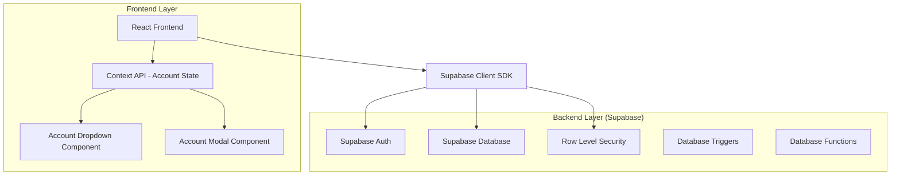
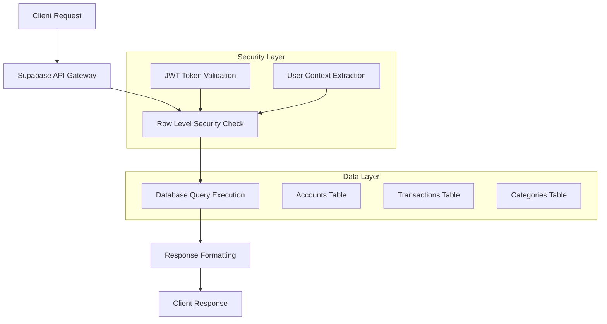
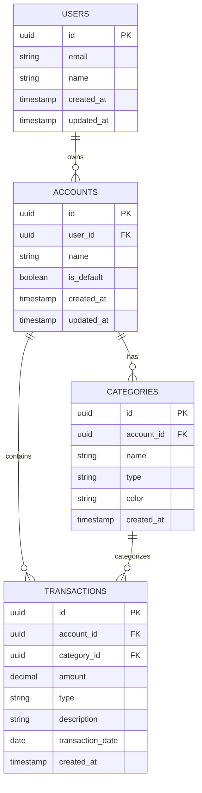

# Arquitetura Técnica - Sistema de Múltiplas Contas

## 1. Architecture Design



## 2. Technology Description
- Frontend: React@18 + TypeScript + Tailwind CSS + Vite
- Backend: Supabase (PostgreSQL + Auth + RLS)
- State Management: React Context API para gerenciamento de conta ativa
- Componentes: Headless UI para dropdown e modal

## 3. Route definitions
| Route | Purpose |
|-------|---------|
| / | Dashboard principal com dropdown de contas |
| /receitas | Página de receitas filtrada por conta ativa |
| /gastos | Página de gastos filtrada por conta ativa |
| /relatorios | Relatórios financeiros da conta ativa |
| /configuracoes | Configurações do usuário e contas |

## 4. API definitions

### 4.1 Core API

**Listar contas do usuário**
```
GET /rest/v1/accounts?user_id=eq.{user_id}
```

Response:
| Param Name | Param Type | Description |
|------------|------------|-------------|
| id | uuid | ID único da conta |
| name | string | Nome da conta |
| user_id | uuid | ID do usuário proprietário |
| is_default | boolean | Se é a conta padrão |
| created_at | timestamp | Data de criação |

**Criar nova conta**
```
POST /rest/v1/accounts
```

Request:
| Param Name | Param Type | isRequired | Description |
|------------|------------|------------|-------------|
| name | string | true | Nome da conta (máx 50 chars) |
| user_id | uuid | true | ID do usuário (automático via RLS) |

Response:
| Param Name | Param Type | Description |
|------------|------------|-------------|
| id | uuid | ID da nova conta criada |
| name | string | Nome confirmado |
| is_default | boolean | false para novas contas |

## 5. Server Architecture Diagram



## 6. Data Model

### 6.1 Data Model Definition



### 6.2 Data Definition Language

**Tabela de Contas (accounts)**
```sql
-- Criar tabela accounts
CREATE TABLE accounts (
    id UUID PRIMARY KEY DEFAULT gen_random_uuid(),
    user_id UUID NOT NULL REFERENCES auth.users(id) ON DELETE CASCADE,
    name VARCHAR(50) NOT NULL,
    is_default BOOLEAN DEFAULT false,
    created_at TIMESTAMP WITH TIME ZONE DEFAULT NOW(),
    updated_at TIMESTAMP WITH TIME ZONE DEFAULT NOW(),
    
    CONSTRAINT unique_user_account_name UNIQUE(user_id, name),
    CONSTRAINT max_accounts_per_user CHECK (
        (SELECT COUNT(*) FROM accounts WHERE user_id = accounts.user_id) <= 10
    )
);

-- Índices para performance
CREATE INDEX idx_accounts_user_id ON accounts(user_id);
CREATE INDEX idx_accounts_default ON accounts(user_id, is_default) WHERE is_default = true;

-- RLS (Row Level Security)
ALTER TABLE accounts ENABLE ROW LEVEL SECURITY;

CREATE POLICY "Users can view own accounts" ON accounts
    FOR SELECT USING (auth.uid() = user_id);

CREATE POLICY "Users can create own accounts" ON accounts
    FOR INSERT WITH CHECK (auth.uid() = user_id);

CREATE POLICY "Users can update own accounts" ON accounts
    FOR UPDATE USING (auth.uid() = user_id);

CREATE POLICY "Users can delete own accounts" ON accounts
    FOR DELETE USING (auth.uid() = user_id);

-- Trigger para garantir uma conta padrão por usuário
CREATE OR REPLACE FUNCTION ensure_single_default_account()
RETURNS TRIGGER AS $$
BEGIN
    IF NEW.is_default = true THEN
        UPDATE accounts 
        SET is_default = false 
        WHERE user_id = NEW.user_id AND id != NEW.id;
    END IF;
    RETURN NEW;
END;
$$ LANGUAGE plpgsql;

CREATE TRIGGER trigger_ensure_single_default
    BEFORE INSERT OR UPDATE ON accounts
    FOR EACH ROW EXECUTE FUNCTION ensure_single_default_account();
```

**Modificações nas tabelas existentes**
```sql
-- Adicionar account_id às transações existentes
ALTER TABLE transactions ADD COLUMN account_id UUID REFERENCES accounts(id) ON DELETE CASCADE;

-- Criar índice para performance
CREATE INDEX idx_transactions_account_id ON transactions(account_id);

-- Atualizar RLS para incluir account_id
DROP POLICY IF EXISTS "Users can view own transactions" ON transactions;
CREATE POLICY "Users can view own transactions" ON transactions
    FOR SELECT USING (
        account_id IN (
            SELECT id FROM accounts WHERE user_id = auth.uid()
        )
    );

-- Adicionar account_id às categorias
ALTER TABLE categories ADD COLUMN account_id UUID REFERENCES accounts(id) ON DELETE CASCADE;

CREATE INDEX idx_categories_account_id ON categories(account_id);

-- Atualizar RLS para categorias
DROP POLICY IF EXISTS "Users can view own categories" ON categories;
CREATE POLICY "Users can view own categories" ON categories
    FOR SELECT USING (
        account_id IN (
            SELECT id FROM accounts WHERE user_id = auth.uid()
        )
    );
```

**Função para criar conta padrão**
```sql
-- Função para criar conta padrão ao registrar usuário
CREATE OR REPLACE FUNCTION create_default_account()
RETURNS TRIGGER AS $$
BEGIN
    INSERT INTO accounts (user_id, name, is_default)
    VALUES (NEW.id, 'Conta Principal', true);
    RETURN NEW;
END;
$$ LANGUAGE plpgsql;

-- Trigger para criar conta padrão
CREATE TRIGGER trigger_create_default_account
    AFTER INSERT ON auth.users
    FOR EACH ROW EXECUTE FUNCTION create_default_account();
```

**Dados iniciais**
```sql
-- Migração para usuários existentes (criar conta padrão)
INSERT INTO accounts (user_id, name, is_default)
SELECT 
    id as user_id,
    'Conta Principal' as name,
    true as is_default
FROM auth.users 
WHERE id NOT IN (SELECT DISTINCT user_id FROM accounts WHERE user_id IS NOT NULL);

-- Atualizar transações existentes para conta padrão
UPDATE transactions 
SET account_id = (
    SELECT id FROM accounts 
    WHERE user_id = (
        SELECT user_id FROM transactions t2 
        WHERE t2.id = transactions.id 
        LIMIT 1
    ) AND is_default = true
)
WHERE account_id IS NULL;

-- Atualizar categorias existentes para conta padrão
UPDATE categories 
SET account_id = (
    SELECT id FROM accounts 
    WHERE user_id = (
        SELECT user_id FROM categories c2 
        WHERE c2.id = categories.id 
        LIMIT 1
    ) AND is_default = true
)
WHERE account_id IS NULL;
```