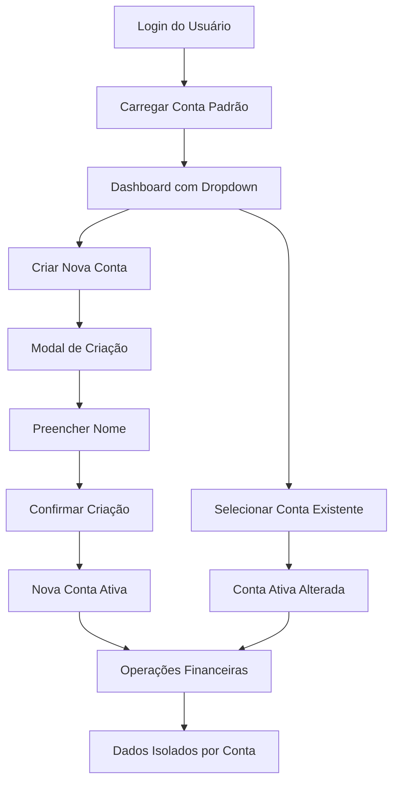

# Sistema de Múltiplas Contas por Usuário - Finança Fácil

## 1. Product Overview
Implementação de sistema que permite aos usuários criar e gerenciar múltiplas contas financeiras independentes (pessoal, profissional, casal, etc.) dentro da mesma conta de usuário principal.
- Soluciona a necessidade de separação de contextos financeiros sem criar múltiplas contas de usuário
- Direcionado a usuários que gerenciam diferentes tipos de finanças simultaneamente
- Aumenta o valor do produto oferecendo maior flexibilidade e organização financeira

## 2. Core Features

### 2.1 User Roles
| Role | Registration Method | Core Permissions |
|------|---------------------|------------------|
| Usuário Autenticado | Login existente | Pode criar, visualizar e gerenciar suas próprias contas financeiras |
| Conta Ativa | Seleção via dropdown | Contexto atual para todas as operações financeiras |

### 2.2 Feature Module
Nosso sistema de múltiplas contas consiste nas seguintes páginas principais:
1. **Dashboard Principal**: dropdown de seleção de contas, indicador de conta ativa, botão criar nova conta
2. **Modal de Criação de Conta**: formulário de nome da conta, validações, botões de ação
3. **Páginas Existentes**: todas as páginas atuais adaptadas para contexto de conta ativa

### 2.3 Page Details
| Page Name | Module Name | Feature description |
|-----------|-------------|---------------------|
| Dashboard Principal | Dropdown de Contas | Listar todas as contas do usuário, permitir seleção da conta ativa, mostrar nome da conta atual |
| Dashboard Principal | Botão Nova Conta | Abrir modal de criação, validar permissões de criação |
| Modal Criação | Formulário | Capturar nome da conta, validar unicidade, criar nova conta no banco |
| Modal Criação | Controles | Botões cancelar e criar, feedback visual de loading |
| Todas as Páginas | Contexto de Conta | Filtrar dados por account_id, manter isolamento entre contas |

## 3. Core Process

**Fluxo Principal do Usuário:**
1. Usuário faz login normalmente
2. Sistema carrega conta padrão ou última conta ativa
3. Usuário pode alternar entre contas via dropdown no menu principal
4. Para criar nova conta: clica em "Criar nova conta" → preenche nome → confirma criação
5. Todas as operações financeiras são isoladas por conta ativa

## 4. User Interface Design

### 4.1 Design Style
- Cores primárias: Manter paleta atual do sistema (#3B82F6 azul, #10B981 verde)
- Cores secundárias: #6B7280 para textos secundários, #F3F4F6 para backgrounds
- Botões: Estilo rounded-lg, sombras sutis, estados hover e focus
- Fontes: Inter ou system fonts, tamanhos 14px (corpo), 16px (títulos), 12px (labels)
- Layout: Card-based design, navegação top-bar, componentes modulares
- Ícones: Heroicons ou Lucide, estilo outline, tamanho 20px padrão

### 4.2 Page Design Overview
| Page Name | Module Name | UI Elements |
|-----------|-------------|-------------|
| Dashboard Principal | Dropdown Contas | Select customizado, ícone de conta, nome da conta ativa, seta dropdown |
| Dashboard Principal | Botão Nova Conta | Botão secundário, ícone "+", texto "Criar nova conta", posicionado no dropdown |
| Modal Criação | Container | Modal overlay escuro, card centralizado, largura máxima 400px |
| Modal Criação | Formulário | Input text para nome, label "Nome da conta", validação em tempo real |
| Modal Criação | Ações | Botão "Cancelar" (secundário), "Criar" (primário), loading state |

### 4.3 Responsiveness
Design mobile-first com adaptações para desktop. Dropdown de contas se transforma em bottom sheet no mobile. Modal de criação ocupa 90% da largura em telas pequenas.